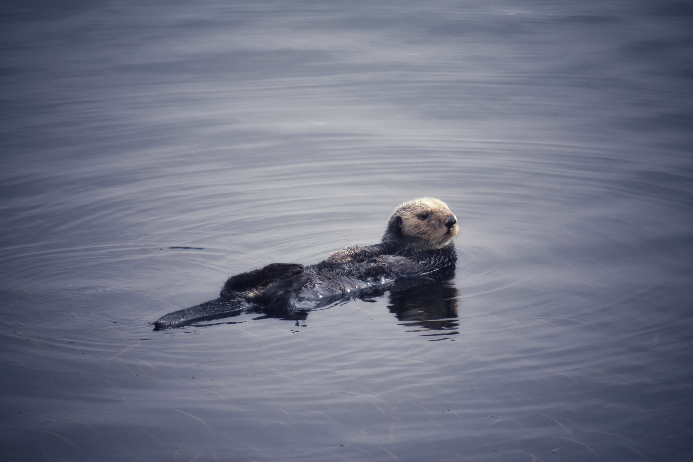
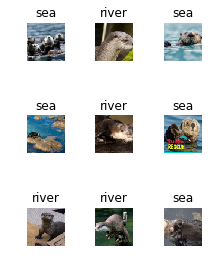
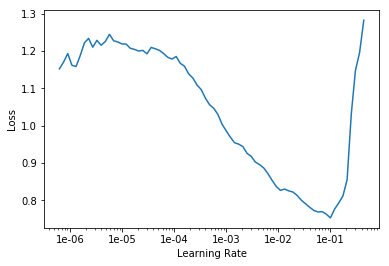
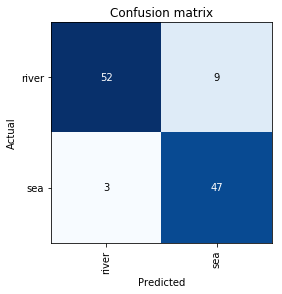

# Image Classification - Otters

A Convoluted Neural Network that classifies images as a Sea Otter or River Otter. 
The [Web App](https://otter-classifier-255602.appspot.com/) of the trained model is deployed using Google Cloud Platform.

    

## Objective

The purpose of this project is to predict whether an image is a Sea Otter or a River Otter. Many people mix up sea otters with river otters, as there are physical similarities between them. This project serves to see if a machine would be able to distinguish between the two species despite their similarities.

## Motivation

This is primarily an *educational* project for me to learn about deep learning through Python. My model relies on the [fastai](https://github.com/fastai/fastai) library, a deep learning library built on top of [PyTorch](https://github.com/pytorch/pytorch). 

I added a fun element to this project by training the model on images of otters. As many of my friends know, sea otters are my favorite animal, and I get asked a lot about the visual differences between sea otters and river otters. This motivated me to build a CNN model, which is known to perform well on image classification, and deploy it on a [Web App](https://otter-classifier-255602.appspot.com/). 

## Project Description

### Set Up

1. Jupyter Notebook
The main file uses Jupyter Notebook. Please follow the instructions [here](https://github.com/pl2599/Image-Classification-Otters/tree/master/doc) to install Jupyter Notebook.

2. fastai Library
Likewise, please follow the instructions [here]((https://github.com/pl2599/Image-Classification-Otters/tree/master/doc)) to install fastai.

### Data

The data used to train the mdoel are 400 images from google for each of the two classes:
* Sea Otter
* River OTter

These images are read from a text file containing the urls and validated using the *download_images* and *verify_images* functions respectively. The classes are tagged based on the folder that the images reside in using the *ImageDataBunch.from_folder* function.

Here is a glimpse of the data:

### Model

I use a Convoluted Neural Network ("CNN") to train images of otters, as CNN is known to perform well on image classification. The model implements the following concepts:

#### Transfer Learning

I use [ResNet50](https://www.mathworks.com/help/deeplearning/ref/resnet50.html), a pre-trained CNN that uses the imagenet dataset as the backbone of our model. Transfer learning allows me to utilize this model that has already been trained on a large dataset and customize it for my more specific use-case. 

When initialized, the initial layers of the CNN are frozen, so only the last layer could be trained on. Therefore I have to *unfreeze* the models after each training iteration. After unfreezing the layers of the model, I can adjust the weights of the layers by training it on only the sea otters and river otter images. 

#### One Cycle Policy

The *learn.fit_one_cycle* model that is utilized to train the CNN follows Leslie Smith's [One Cycle Policy](https://arxiv.org/abs/1803.09820). Essentially, the motivation is to vary the learning rate as it progresses through the layers to improve performance and speed up training. I implement the One Cycle Policy by following this general progression:

1. Determine Learning Rate (lr) via *learn.recorder.plot*
2. Train using *learn.fit_one_cycle* 
3. Unfreeze Layers
4. Determine new learning rate (new_lr)
4. Train using *learn.fit_one_cycle*

An example of the reading the learning plot to determine the learning rate is shown below:

Looking at this plot, the slope is steepest from 1e-4 to 1e-2. Therefore, an appropriate learning rate here is around 3e-3. 

#### Progressive Resizing

This concept is taught and used by Jeremy Howard to enhance model performance. In this project, I initially trained our model using 64x64 images of otters using the One Cycle Policy. Afterwards, using the trained model, I repeated the process using the same images, but sized to 128x128.

## Outcome

In the end, the model has a 89% accuracy tested on the validation set. The confusion matrix below illustrates this.

As there are many similarities between Sea Otters and River Otters (especially in water), this accuracy rate is pretty high for this case.